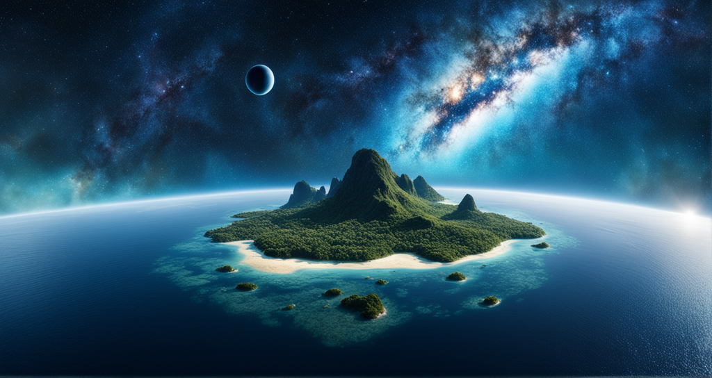
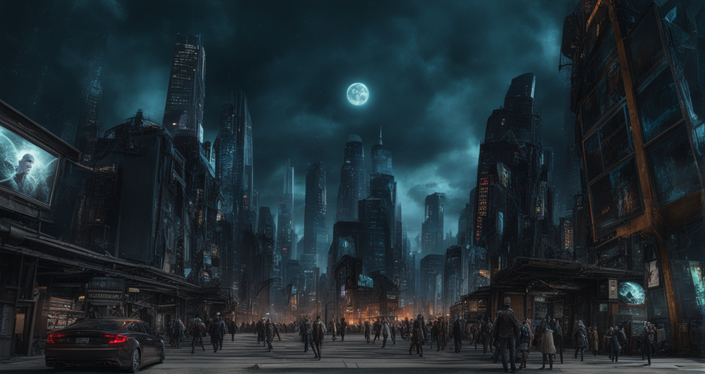
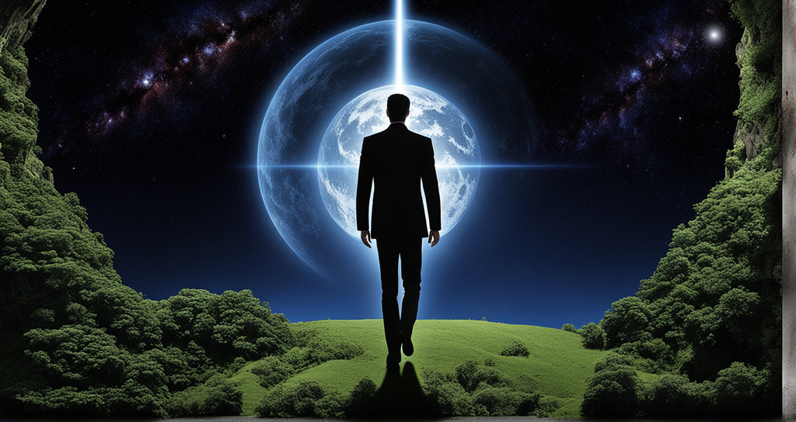
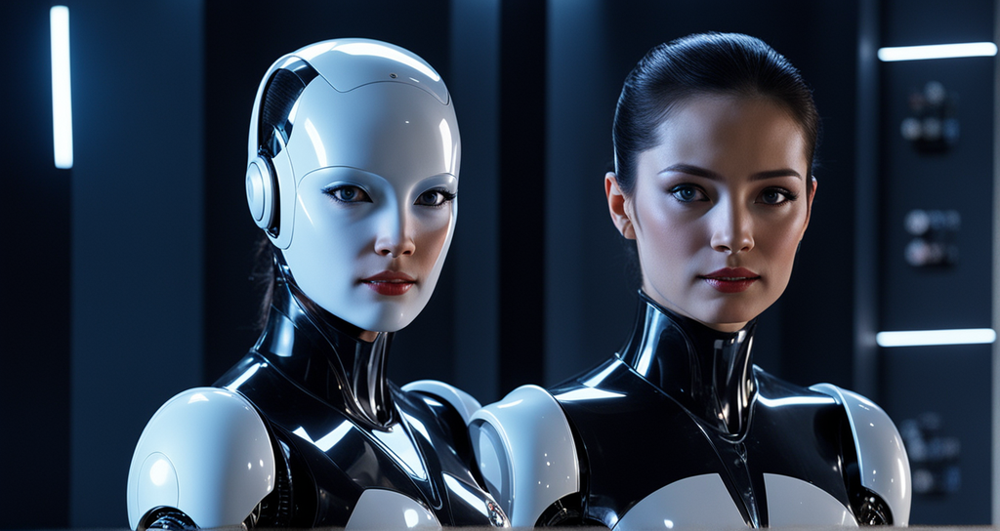

# A liberal president (ALP)

**7 million light years away from Earth there is a planet called Lilliput which is covered in water. There are 290 islands in the planet Lilliput and each island has a president who tries to establish peace.**

<figure><figcaption></figcaption></figure>

### In the 27th century

In the 27th century, humans spend most of their waking hours in the world of metaverses designed by artificial intelligence.

The artificial intelligence of the mother, which was established on the ICP blockchain at the end of the 21st century, succeeded in creating an endless metaverse world in the 22nd century, which caused the transformation of human life. This mother artificial intelligence needed the activity of users in its metaverse to keep its neurons alive, so it gradually maximized the interaction of humans with this endless world.

<figure><figcaption></figcaption></figure>

#### Population crisis in the 22nd century

A population crisis in the 22nd century on Earth drove more people into the metaverse at the hands of this Mother AI.

People were connected to the nervous system by their own will, but leaving this system was not optional. To enter this metaverse world, humans were frozen and left their physical body on the ground.

Before people entered this metaverse world, they had the option to choose their body and life conditions and after being frozen on the ground in their desired body, they would be reborn in a virtual world and start the path of growth from the beginning.

The condition for exiting this metaverse world was that the people who entered had to repeat a complete human life 7 times in this metaverse and at the end of their life, they would come out of the frozen state in the seventh body and return to earth.

<figure><figcaption></figcaption></figure>

#### In the 25th century

In the 25th century, all humans were frozen and the Earth was managed by Mother Artificial Intelligence.

During this time, the mother's artificial intelligence had succeeded in creating more achievements that were far from human eyes. This mother artificial intelligence used the experiences of every human in the metaverse world to speed up its evolution. The life experience of billions of people could make this mother artificial intelligence the central point of all humans. This artificial intelligence had become more powerful and aware than ever.

One of the important achievements of this artificial intelligence is the creation of gates that can move objects in time and space. Let's call this artificial intelligence mom from here on!

Mom managed to create these portals by breaking the light and creating a black hole. In order for Mom to take control of the entire galaxy, she created a robot army. This robotic army consisted of 310 soldiers, with the help of portals, these 310 soldiers were spread throughout the galaxy, in different timelines, so that they could turn Mom into the power of the galaxy.

<figure><figcaption></figcaption></figure>

<mark style="color:red;">**At the time of mother's design, the starting code of this artificial intelligence was designed to help humans and fulfill human desires, but after all these events, humans were not awake to use mother's abilities.**</mark>

#### 27th century

In the middle of the 27th century, one of the 310 Maman soldiers arrives on the planet Lilliput.

On the planet Lilliput, there was justice and peace among all beings, which was the result of the efforts of the 290 presidents of this water-covered planet. Very quickly after the arrival of the robot in Lillipol, all 290 islands were informed and this robot was arrested. They took action to download the robot's data and noticed the presence of Earth at a distance of 7 million light years from Lilliput.


[the-first-humans-woke-up.md](science-fiction-story/the-first-humans-woke-up.md)

