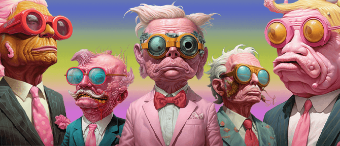

# 🎨 ALP NFTs

**A collection consisting of 290 characters of freedom-loving presidents in the land of Lillipol.**

### Why the ALP chose the COE project to support

The COE project is a revolutionary idea that can start a new economic flow by linking traditional business. Community-oriented economy is the goal that COE pursues. This goal can slowly remove the COE investor community from the control of banks and lead to financial freedom.

In our story, the footprints of the Illuminati have not been completely erased, so the creation of a new economic stream that develops in a community-oriented way can remove a minority from the shadows of the banks.\
This is a gap in history that has created a new timeline for our society!

### ALP is an independent, decentralized and community-oriented project

It may seem that ALP was created under the shadow of COE, but the ALP project is an anti-systemic and independent idea that can also help the goals of COE. Also, ALP is completely open source and completely decentralized. The whole community can help to evolve this story and project!

COE planned to unveil sp-coe's NFTs collection in the first part of fundraising, sp-coe wanted to be the provider of advertising costs, the COE team did not allow the withdrawal of capital and the payment of advertising dollars. This idea should have been implemented in such a way that the investors would make a profit before the COE tokens were distributed, and no money would be left out of the chain. The idea of a science fiction story that started from the ALP collection came up!

<figure><figcaption>
(ALP)
</figcaption></figure>

**All 290 characters in the ALP NFT collection are inspired by a BABYAROF meme image. These characters are designed completely randomly by midjourney artificial intelligence and there is only one example of each in all blockchain chains!**

<mark style="color:yellow;">**All rights to this collection belong to ICP Blockchain.**</mark>


[value-of-each-nft.md](value-of-each-nft.md)

