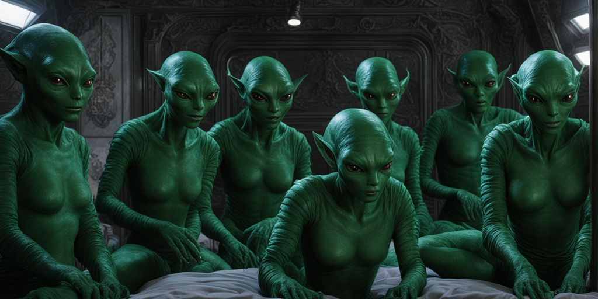

# The first humans woke up

**All 290 presidents made a decision after the information of the mother robot was unloaded on the planet Lilliput! They realized a great danger. If they do not stop the mother, there is a possibility that they will become slaves of the mother. They decided that one of the presidents would be elected and travel to Earth so that he could wake up some humans and take the power away from the mother.**

<figure><figcaption></figcaption></figure>

## selected president

After voting among the 290 presidents of the planet Lilliput, they chose one as the chosen one, and this chosen president was prepared to travel to Earth.

We know this president-elect by the abbreviation ALP.\
**ALP stands for A liberal president.**

ALP opened a portal with the robot's help and traveled to Earth. The ALP woke up thirteen people and unfrozen them.

The people who woke up were not the same as before, in the depths of their unconscious they had gained life and experience instead of 5 generations. On the other hand, freezing for 500 years and chemical nutrition had caused changes in these people.

Dry and greenish skins, bigger brain and smaller mouth, also bigger eyes.\
**After 500 years, humans had become like their imaginations towards extraterrestrials.**

<figure><figcaption></figcaption></figure>

#### ALP and 13 humans

ALP transfers all his knowledge and information as one of the successful leaders on the planet Lilliput to 13 humans so that these humans learn how to use the mother with complete justice and return security to the galaxy.

After some time, ALP returns to Lilliput. The 13 humans decide to travel back in time before more humans wake up and upload signs to the ancient humans so that they might be able to help and prevent the rapid creation of the mother. These 13 people cannot appear before the eyes of the people of the past in the 21st and 22nd centuries, because they have no intellectual resemblance to ordinary people.

They appeared at different times in the past and communicated indirectly with 124 thousand humans, they rewrote the laws of the past to establish the framework of justice.

**Gradually, these 13 people became arrogant and prideful, they lost all their beliefs and believed that they are the leaders behind the curtain of the world.**

### Establishment of the Illuminati

Time travel is crazy for living things and humans. They had believed that there was no higher power than them and that they were the rulers of the world.

**Humans are aware and feel that the traces of the interference of these 13 people were left in the history of humanity, and people called these 13 people as a group called Illuminati!**

<figure><figcaption></figcaption></figure>

Human nature is such that if he feels under control, he will fight back.\
<mark style="color:red;">**The only change in the beliefs of humans in the 21st century was enough to change all programmed time threads again, and this was just the beginning of the story.**</mark>

### The world is controlled by the Illuminati

They traveled in time lines and this made them have the most accurate information system. In this way, thoughts, desires and everything you can imagine were under control. If a person even developed a revolutionary thought in his mind, they would send their agents to change his thinking to bring the situation back to normal.

A revolutionary thinking makes sense in the future, they saw the future and made changes in the past to prevent things from happening so that everything would progress according to their wishes.

The Illuminati did everything to delay the time between the creation of the Mother and the awakening of the fourteenth human in the 27th century.\
**By creating war and disease, they reduced the population every time to delay the population crisis in the 22nd century.**

#### How did the Illuminati group control the world?

These 13 mutants had the ability to travel in time, so they started planting beliefs in the human race from the beginning of human history. They infiltrated the education, treatment and service systems, they left clues for the famous people of history to finally manifest the achievements in the way they wanted.

The most powerful tool to control the world was bills and money, these 13 people did not need money, but directing money in such a way as to fulfill their wishes was one of the most important tools of the Illuminati.

They traveled to all the centuries and left signs of themselves so that their existence as superior beings for humans was institutionalized like belief.

### 310 mother robots are still on tour!

The 310 robots that spread across the galaxy before all these stories in different timelines notice the Illuminati's activities...

The mission of these robots was to increase the mother's power, but the mother does not follow the robots and they could not convince the mother not to help the Illuminati!

<mark style="color:red;">**The robots investigate to find out why these 13 people woke up and how this happened... They find out that the ALP from the planet Lilliput did this to solve the mother's power crisis...**</mark>

<figure><figcaption></figcaption></figure>


[the-return-of-the-alp.md](the-return-of-the-alp.md)

